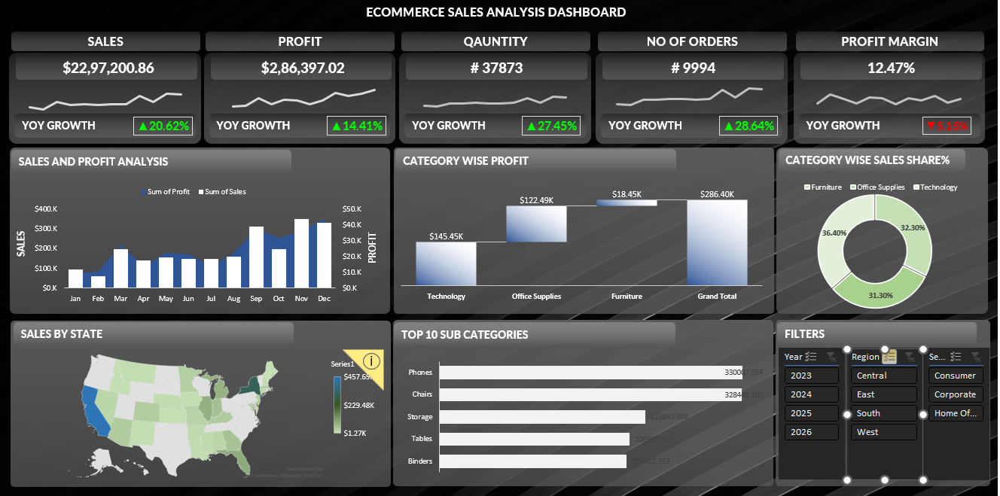

# 📊 E-Commerce Sales Analysis Dashboard

## 📌 Project Overview

This project presents an interactive E-Commerce Sales Analysis Dashboard developed using Microsoft Excel.

The dashboard helps analyze sales performance, profitability, order trends, product categories, sub-categories, and regional performance through interactive visualizations and filters.

## 🎯 Objectives

- Analyze overall sales and profit performance
- Track Year-over-Year (YOY) growth
- Monitor quantity and number of orders
- Analyze profit margin
- Identify profitable product categories
- Analyze sales performance by state
- Identify top-performing sub-categories
- Enable interactive analysis using filters

## 🛠️ Tools Used

- Microsoft Excel
- Pivot Tables
- Pivot Charts
- Slicers
- Excel Formulas
- Data Visualization

## 📊 Key KPIs

- Total Sales
- Total Profit
- Total Quantity
- Number of Orders
- Profit Margin
- YOY Growth

## 🔍 Dashboard Features

### Sales & Profit Analysis
Monthly comparison of sales and profit performance.

### Category Wise Profit
Analysis of profit contribution by product category.

### Category Wise Sales Share
Percentage contribution of different categories to total sales.

### Sales by State
Geographical analysis of sales performance across states.

### Top 10 Sub-Categories
Identification of the highest-performing sub-categories.

### Interactive Filters
Users can filter the dashboard by:

- Year
- Region
- Segment

## 🖼️ Dashboard Preview

## 📂 Project Files

| File | Description |
|------|-------------|
| `data.xlsx` | Complete Excel workbook containing data, analysis and dashboard |
| `dashborad.png` | Dashboard preview |

## 💡 Key Insights

The dashboard provides a consolidated view of business performance and helps identify trends in sales, profit, product categories, sub-categories and regional performance.

## 🚀 Conclusion

This project demonstrates practical skills in Excel-based data analysis, dashboard development, KPI tracking and business data visualization.

---

### 👩‍💻 Author

**Monika Goyal**
